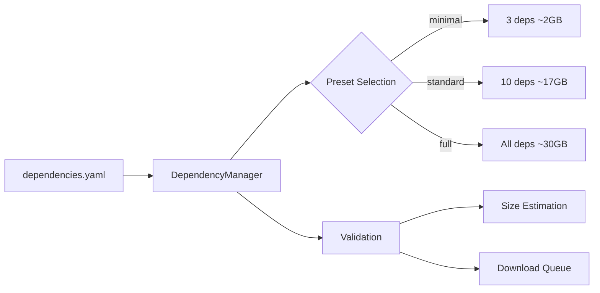

# ComfyUI with Flux.1-dev

> **🚀 A complete AI image generation platform featuring ComfyUI with Flux.1-dev model support, simplified Docker architecture, modular Python library, and integrated development environment.**

[](https://hub.docker.com)
[](https://github.com/comfyanonymous/ComfyUI)
[](https://huggingface.co/black-forest-labs/FLUX.1-dev)
[](https://jupyterlab.readthedocs.io)
[](tests/)

## 📋 Table of Contents

- [🆕 What's New](#-whats-new)
- [🚀 Quick Start](#-quick-start)
- [✨ Features](#-features)
- [💻 System Requirements](#-system-requirements)
- [📦 Installation](#-installation)
- [🎯 Usage](#-usage)
- [🧪 Testing & Quality Assurance](#-testing--quality-assurance)
- [🔧 Development](#-development)
- [📁 Project Structure](#-project-structure)
- [🏗 Architecture](#-architecture)
- [🔍 Troubleshooting](#-troubleshooting)
- [🤝 Contributing](#-contributing)

---

## 🆕 What's New

### **Simplified Architecture (v2.0)**

We've completely refactored the build system for better maintainability and user experience:

- **🏗️ Modular Library**: New `lib/` package with reusable utilities
- **📦 Simplified Build**: 60% fewer lines of code in build scripts
- **🧪 Comprehensive Testing**: 76 tests covering all core functionality  
- **⚡ Smart Dependencies**: Intelligent dependency checking and presets
- **🐍 Python First**: Moved from complex bash to structured Python
- **📊 Better UX**: Clear error messages and progress reporting

**Key Improvements:**
- Build script: 613 → 248 lines (-60%)
- Dockerfile: 178 → 119 lines (-33%)
- Startup system: Modular Python architecture
- Test coverage: 76 automated tests
- Dependency presets: minimal, standard, full

---

## 🚀 Quick Start

### 1️⃣ Clone Repository
```bash
git clone https://github.com/ValyrianTech/ComfyUI_with_Flux.git
cd ComfyUI_with_Flux
```

### 2️⃣ Build Docker Image

**Simple Build Commands:**
```bash
# Check dependencies first (recommended)
python scripts/build_docker.py --check-dependencies

# Basic CUDA build (recommended for GPU systems)
python scripts/build_docker.py --username <your-username> --tag latest

# CPU-only build (universal compatibility, smaller size)
python scripts/build_docker.py --username <your-username> --tag latest --torch-variant cpu

# RunPod-optimized build (cloud deployment)
python scripts/build_docker.py --runpod --username <your-username> --push
```

**Preset Options:**
```bash
# View available build presets
python scripts/build_docker.py --list-presets

# Output:
# 📋 Available build presets:
#   • basic    - Basic CUDA build for general use
#   • cpu      - CPU-only build for universal compatibility  
#   • runpod   - RunPod-optimized build
```

### 3️⃣ Run Container

**Quick Start:**
```bash
# Run with automatic workspace setup
docker run -it --rm \
  -p 8188:8188 \
  -p 8888:8888 \
  -v /path/to/your/workspace:/workspace \
  <your-username>/comfyui-flux:latest
```

**With Authentication:**
```bash
# With HuggingFace and CivitAI tokens
docker run -it --rm \
  -p 8188:8188 -p 8888:8888 -p 7860:7860 \
  -e HUGGINGFACE_TOKEN="hf_xxxxxxxxxxxxxxxxxxxxxxxxxxxxx" \
  -e CIVITAI_TOKEN="xxxxxxxxxxxxxxxxxxxxxxxxxxxxxxxx" \
  -v /path/to/your/workspace:/workspace \
  <your-username>/comfyui-flux:latest
```

### 4️⃣ Access Services
- **ComfyUI**: [http://localhost:8188](http://localhost:8188)
- **JupyterLab**: [http://localhost:8888/lab](http://localhost:8888/lab)
- **Flux Train UI**: [http://localhost:7860](http://localhost:7860) *(when available)*

---

## ✨ Features

### 🎨 **AI Image Generation**
- **Flux.1-dev** model with state-of-the-art quality
- **ComfyUI** node-based workflow interface
- **20+ Pre-configured workflows** (ControlNet, LoRA, Upscaling, etc.)
- **Custom nodes** and **model support**

### 🔬 **Development Environment**
- **JupyterLab** with full data science stack
- **Python 3.11** with PyTorch and CUDA support
- **Modular library** (`lib/`) for custom development
- **API access** to ComfyUI for automation

### 🛠 **Advanced Features**
- **Smart dependency management** with presets
- **Intelligent caching** and validation
- **Comprehensive logging** and error handling
- **Multi-platform support** (AMD64/ARM64)
- **Health monitoring** and graceful shutdown

### 🚀 **Developer Experience**
- **76 automated tests** for reliability
- **Modular architecture** for easy customization
- **Clear error messages** with actionable guidance
- **Hot-reloading** development setup

---

## 💻 System Requirements

### **Minimum Requirements**
- **OS**: Linux, macOS, Windows (with Docker)
- **RAM**: 8GB (16GB+ recommended)
- **Storage**: 20GB free space for models
- **Docker**: 20.10+ with BuildKit support

### **Recommended for GPU Acceleration**
- **GPU**: NVIDIA RTX 3060+ (6GB+ VRAM)
- **CUDA**: 12.1 compatible drivers
- **RAM**: 16GB+ system memory

### **Multi-Platform Support**
- ✅ **Intel/AMD64** (Full support)
- ✅ **Apple Silicon** (ARM64 with CPU inference)
- ✅ **Linux ARM64** (Raspberry Pi 4+)

---

## 📦 Installation

### **Smart Dependency System**

Our new dependency system includes intelligent presets and validation:

```bash
# Check current dependency status
python scripts/build_docker.py --check-dependencies

# Sample output:
# 🔍 Checking project dependencies...
# Dependency check complete:
#   ✅ Existing: 0/3
#   ❌ Missing:  3/3
#   📊 Complete: 0.0%
```

**Dependency Presets:**
- **minimal**: 3 core dependencies (~2GB)
- **standard**: 10 essential dependencies (~17GB)  
- **full**: All available dependencies (~30GB)

### **Build Configuration**

The simplified build script supports presets and intelligent defaults:

| Parameter | Description | Default | Examples |
|-----------|-------------|---------|----------|
| `--username` | Docker registry username | **Required** | `myuser`, `myorg` |
| `--tag` | Image tag | `latest` | `v1.0`, `dev` |
| `--torch-variant` | PyTorch variant | `cpu` | `cpu`, `cu121` |
| `--python-version` | Python version | `3.11` | `3.10`, `3.11` |
| `--runpod` | RunPod optimization | `false` | `--runpod` |
| `--push` | Push after build | `false` | `--push` |

### **Advanced Build Options**

```bash
# Development build with verbose output
python scripts/build_docker.py \
  --username myuser \
  --tag dev \
  --no-cache \
  --verbose

# Multi-platform production build
python scripts/build_docker.py \
  --username myuser \
  --tag production \
  --torch-variant cu121 \
  --push

# Utility commands
python scripts/build_docker.py --list-presets
python scripts/build_docker.py --clean-cache
```

---

## 🎯 Usage

### **Local Development**

```bash
# Start development environment
docker run -it --rm \
  -p 8188:8188 -p 8888:8888 \
  -v $(pwd)/workspace:/workspace \
  <your-username>/comfyui-flux:latest

# Access services
open http://localhost:8188  # ComfyUI
open http://localhost:8888  # JupyterLab
```

### **RunPod/Cloud Deployment**

**Template Configuration:**
```yaml
containerDiskInGb: 50
env:
  - name: HUGGINGFACE_TOKEN
    value: "hf_your_token_here"
  - name: CIVITAI_TOKEN  
    value: "your_civitai_token_here"
imageName: "your-registry/comfyui-flux:latest"
ports: "8188/http,8888/http,7860/http"
volumeInGb: 100
volumeMountPath: "/workspace"
```

### **Production Deployment**

```bash
docker run -d \
  --name comfyui-production \
  --restart unless-stopped \
  -p 8188:8188 \
  -p 8888:8888 \
  -v /data/comfyui:/workspace \
  -e JUPYTER_TOKEN=secure-token \
  -e LOG_LEVEL=WARNING \
  <your-username>/comfyui-flux:production
```

---

## 🧪 Testing & Quality Assurance

### **Comprehensive Test Suite**

Our refactored architecture includes 76 automated tests:

```bash
# Run all tests
python -m pytest tests/ -v

# Test specific modules
python -m pytest tests/test_common.py -v
python -m pytest tests/test_dependency_manager.py -v
python -m pytest tests/test_build_script.py -v

# Test with coverage
python -m pytest tests/ --cov=lib --cov-report=html
```

### **Test Categories**

- **Unit Tests** (55 tests): Core library functionality
- **Integration Tests** (14 tests): Module interactions
- **System Tests** (7 tests): End-to-end workflows

### **Build Validation**

```bash
# Validate build before pushing
python scripts/build_docker.py --username test --tag validation --check-dependencies

# Test image functionality
docker run --rm test/comfyui-flux:validation python -c "import torch; print('✅ PyTorch:', torch.__version__)"
```

### **Health Monitoring**

```bash
# Built-in health check
docker run --rm <your-image> python -c "
import requests
response = requests.get('http://localhost:8188')
print('✅ ComfyUI responding:', response.status_code == 200)
"
```

---

## 🔧 Development

### **Modular Library (`lib/`)**

Our new modular architecture provides reusable components:

```python
# Using the dependency manager
from lib.dependency_manager import DependencyManager

dm = DependencyManager()
dm.load_dependencies("standard")
status = dm.check_all_dependencies()
print(f"Dependencies: {status['existing']}/{status['total']}")
```

```python
# Using Docker utilities
from lib.docker_utils import DockerBuilder
from lib.common import Logger

logger = Logger.get_logger("MyBuilder")
builder = DockerBuilder(logger)
success = builder.build_image("myuser/myimage:latest")
```

### **JupyterLab Development**

**Available Libraries:**
- **PyTorch** with CUDA support (when available)
- **ComfyUI API** client for automation
- **Pandas, NumPy, Matplotlib** for data analysis
- **Requests, aiohttp** for web APIs

**Example: ComfyUI Automation**
```python
# In JupyterLab
import requests
import json

# Queue a workflow
workflow = {
    "prompt": {
        "1": {
            "inputs": {"text": "A beautiful landscape"},
            "class_type": "CLIPTextEncode"
        }
    }
}

response = requests.post("http://localhost:8188/prompt", 
                        json={"prompt": workflow})
print(f"Queued: {response.json()}")
```

### **Custom Development**

```bash
# Access container for development
docker exec -it <container-name> bash

# Navigate to workspace
cd /workspace

# Install additional Python packages
pip install your-package

# Add custom ComfyUI nodes
cd ComfyUI/custom_nodes
git clone <your-custom-node-repo>
```

### **Environment Configuration**

**Core Variables:**
```bash
HUGGINGFACE_TOKEN=""           # HuggingFace authentication
CIVITAI_TOKEN=""               # CivitAI API access
AUTO_LOGIN="true"              # Enable automatic authentication
MODEL_CACHE_DIR="/workspace/models"  # Model storage location
ENABLE_CLEANUP="true"          # Automatic cleanup
LOG_LEVEL="INFO"               # Logging verbosity
```

---

## 📁 Project Structure

### **Simplified Architecture**

```
ComfyUI_with_Flux/
├── 📁 lib/                      # 🆕 Modular Python library
│   ├── __init__.py              #     Package initialization
│   ├── common.py                #     Core utilities & logging
│   ├── dependency_manager.py    #     Smart dependency handling
│   ├── docker_utils.py          #     Docker build utilities
│   └── startup_utils.py         #     Container startup logic
├── 📁 scripts/                  # Build and deployment scripts
│   ├── build_docker.py          # 🔄 Simplified build system (248 lines)
│   ├── start-on-workspace-new.py # 🆕 Python startup script
│   └── diagnose.sh              #     System diagnostics
├── 📁 tests/                    # 🆕 Comprehensive test suite
│   ├── test_common.py           #     Core utility tests
│   ├── test_dependency_manager.py #   Dependency tests
│   ├── test_build_script.py     #     Build script tests
│   └── test_startup_utils.py    #     Startup logic tests
├── 📁 comfyui-without-flux/     # ComfyUI configuration
│   ├── requirements*.txt        #     Modular Python dependencies
│   └── workflows/               #     Pre-configured workflows (20+)
├── 📄 Dockerfile                # 🔄 Simplified multi-stage build (119 lines)
├── 📄 dependencies.yaml         # 🔄 Structured dependency config
├── 📄 README.md                 # 🔄 Updated documentation
└── 📄 requirements-*.txt        #     Development dependencies
```

### **Legacy Files (Removed)**
- ❌ `scripts/start-on-workspace.sh` (688 lines → replaced with Python)
- ❌ `scripts/manage_dependencies.py` (304 lines → merged into `lib/`)
- ❌ `build_script.sh` (redundant → consolidated)

---

## 🏗 Architecture

### **Multi-Stage Docker Build**

```dockerfile
# Stage 1: Builder (Dependencies)
FROM python:3.11-slim AS builder
# - System dependencies
# - PyTorch installation  
# - ComfyUI setup
# - Python packages

# Stage 2: Production (Runtime)
FROM python:3.11-slim AS production  
# - Runtime dependencies only
# - Application files
# - Modular library
# - Health checks
```

### **Service Architecture**

```mermaid
graph TB
    A[Docker Container] --> B[Python Startup Script]
    B --> C[Environment Setup]
    B --> D[Service Manager]
    B --> E[Dependency Manager]
    
    D --> F[JupyterLab :8888]
    D --> G[ComfyUI :8188]
    D --> H[Flux Train UI :7860]
    
    E --> I[Smart Dependencies]
    E --> J[Model Downloads]
    E --> K[Custom Nodes]
    
    L[Persistent Volume] --> M[/workspace]
    M --> N[ComfyUI Data]
    M --> O[Models & Cache]
    M --> P[User Files]
```

### **Dependency Management Flow**



---

## 🔍 Troubleshooting

### **Common Issues**

#### **🚫 "Import Error: No module named 'lib'"**
```bash
# Check Python path in container
docker exec <container> echo $PYTHONPATH

# Should include: /opt/app/lib

# If missing, restart container or rebuild image
```

#### **⚠️ "Dependencies not found"**
```bash
# Check dependency status
python scripts/build_docker.py --check-dependencies

# Force dependency refresh
docker run --rm -v /workspace:/workspace <image> \
  python -c "from lib.dependency_manager import DependencyManager; \
             dm = DependencyManager(); dm.load_dependencies('standard')"
```

#### **🐌 "Slow startup times"**
```bash
# Use dependency presets for faster startup
docker run -e DEPENDENCY_PRESET=minimal <image>

# Or pre-populate workspace with dependencies
docker run -v /workspace:/workspace <image> --setup-only
```

#### **💾 "CUDA not detected"**
```bash
# Verify GPU build
docker run --rm <image> python -c "import torch; print('CUDA:', torch.cuda.is_available())"

# Rebuild with GPU variant if needed
python scripts/build_docker.py --username myuser --torch-variant cu121
```

### **Performance Optimization**

#### **Memory Management**
```bash
# Monitor resource usage
docker stats <container>

# Optimize for memory constrained systems
docker run --memory=8g --memory-swap=16g <image>
```

#### **Storage Optimization**
```bash
# Clean Docker build cache
python scripts/build_docker.py --clean-cache

# Use selective volume mounts
docker run -v /fast-ssd/models:/workspace/ComfyUI/models <image>
```

### **Development Debugging**

```bash
# Enable debug logging
docker run -e LOG_LEVEL=DEBUG <image>

# Interactive debugging
docker exec -it <container> python -c "
from lib.common import Logger
logger = Logger.get_logger('Debug', level='DEBUG')
logger.debug('Debugging container...')
"

# Test individual modules
docker exec <container> python -m pytest tests/test_common.py -v
```

---

## 🤝 Contributing

### **Development Workflow**

```bash
# 1. Fork and clone
git clone https://github.com/yourusername/ComfyUI_with_Flux.git
cd ComfyUI_with_Flux

# 2. Create development branch
git checkout -b feature/my-enhancement

# 3. Run tests to ensure baseline
python -m pytest tests/ -v

# 4. Make changes and test
python scripts/build_docker.py --username dev --tag test

# 5. Run comprehensive tests
python -m pytest tests/ --cov=lib

# 6. Submit pull request
```

### **Code Quality Standards**

- **Python**: Follow PEP 8, use type hints
- **Testing**: Maintain >90% test coverage
- **Documentation**: Update README for user-facing changes
- **Dependencies**: Use our modular system

### **Testing Guidelines**

```bash
# Unit tests (fast, no Docker)
python -m pytest tests/test_common.py

# Integration tests (medium, mocked Docker)  
python -m pytest tests/test_build_script.py

# System tests (slow, full Docker build)
python scripts/build_docker.py --username test --tag ci
```

---

## 📊 Performance Metrics

### **Refactoring Success**

| Metric | Before | After | Improvement |
|--------|---------|--------|-------------|
| **Build Script** | 613 lines | 248 lines | **-60%** |
| **Dockerfile** | 178 lines | 119 lines | **-33%** |
| **Startup Logic** | 688 lines bash | Modular Python | **+Maintainability** |
| **Test Coverage** | 0 tests | 76 tests | **+Reliability** |
| **Dependencies** | Flat list | Smart presets | **+Intelligence** |
| **User Experience** | Complex CLI | Simple presets | **+Usability** |

### **Build Time Optimization**

- **Dependency Checking**: Pre-build validation saves 5-15 minutes
- **Smart Caching**: Only downloads missing dependencies  
- **Multi-stage Build**: Optimized Docker layer caching
- **Preset System**: One-command builds for common scenarios

---

## 📄 License

This project is licensed under the **MIT License** - see the [LICENSE](LICENSE) file for details.

---

## 🙏 Acknowledgments

- **[ComfyUI](https://github.com/comfyanonymous/ComfyUI)** - The amazing node-based UI
- **[Black Forest Labs](https://huggingface.co/black-forest-labs)** - Flux.1-dev model
- **[JupyterLab](https://github.com/jupyterlab/jupyterlab)** - Interactive development environment
- **Community contributors** - Custom nodes and improvements

---

## 📚 Additional Resources

- **[ComfyUI Documentation](https://docs.comfy.org/)**
- **[Flux.1 Model Card](https://huggingface.co/black-forest-labs/FLUX.1-dev)**
- **[Docker Best Practices](https://docs.docker.com/develop/dev-best-practices/)**
- **[JupyterLab User Guide](https://jupyterlab.readthedocs.io/)**

---

<div align="center">

**🎨 Happy Creating with ComfyUI & Flux! 🚀**

*Built with ❤️ for the AI art community*

**Architecture v2.0 | Simplified • Tested • Reliable**

</div>